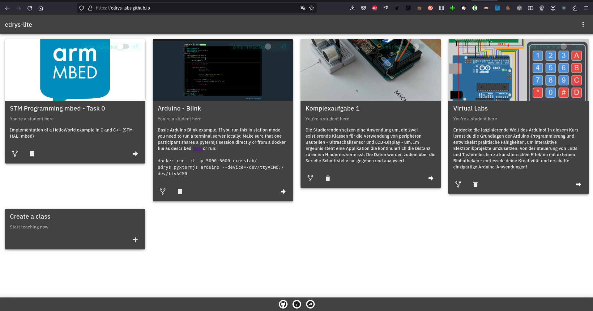

# edrys-Lite: Revolutionizing Remote Laboratories

Welcome to edrys-Lite, the cutting-edge open-source project designed to revolutionize how we create and share remote laboratories. In a world where education and research are increasingly moving online, edrys-Lite provides an intuitive and simplistic way for users to engage with laboratory environments directly from their browser -- no servers required.

## Introduction

- Project name and a brief, compelling overview
- Vision statement or inspirational quote that reflects the ethos of the project

Inspired by @edrysorg, which is unfortunately not under active development, edrys-Lite aims to provide a serverless peer-to-peer approach for remote laboratories. By leveraging the latest web technologies, such as WebRTC for real-time, peer-to-peer connections, and CRDTs for collistion free state handling, edrys-Lite offers a seamless, serverless experience for users worldwide.

Whether you're a student, educator, researcher, or enthusiast, edrys-Lite invites you to explore, contribute, and grow with us. Together, we can unlock new realms of possibility and innovation in the digital age.

## ✨ Features

- __Live Classrooms:__
  Live chat, create rooms, and interact in different modules

- __Remote Labs:__
  Allow students to interact with your real lab equipment remotely & asynchronously

- __Modular:__
  Build your class by combining Modules or make your own with an easy real-time API

- __Easy to start:__
  Entirely browser-based, no hosting, no backend, no databases or any other dependencies to set up

- __Privacy-friendly:__
  Passwordless auth with autogenerated user-ids, without any tracking or data collection

- __Fast & Modern:__
  Based on a modern peer-2-peer approach with Conflict-free-Replicated-DataTypes (CRDTs) and deliberately small codebase

- __Free and Open Source, forever:__
  No paywall features or lock-in

## 📸 Screenshots

## 💡 Use cases

- __Live online teaching:__
  One to one, one to many, and many to many live classrooms

- __Remote Labs:__
  Allow students to access and control live equipment remotely (eg. remote Arduino fleet)

- Flipped classrooms and blended learning: Create modules to deliver virtually any content asynchronously
Group coursework: Dynamic breakout rooms and easy jumping between rooms

## 📚 Documentation

For more information, please refer to the [official documentation](https://github.com/edrys-labs/documentation).